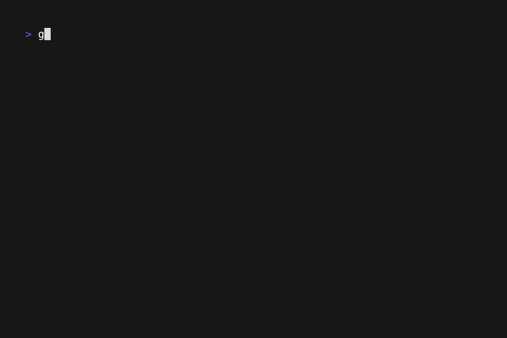

# GMMIT

This a small terminal tool to help developers or any person interacting with Git to write their commit messages.

---

You'd certainly agree that inspecting a properly maintained git history log that follows the [Conventional Commits](https://www.conventionalcommits.org) standard is nice and simple.
And you'd also agree that having to dedicate time to come up with those neat and descriptive messages is a bummer. Well, here's where **gmmit** comes to saves the day.

Run the `gmmit` command on a folder with a git repository, and it will check your staged changes, the current branch name, and generate a tidy commit message for you, and even run "git commit".
After that, just execute `git push`, and it's done.


## Getting started

### Usage

#### Options

| option | description |
| ------ | ----------- |
| --no-verify | Add the option to skip git hooks and commit even if the pre-commit hooks fail. This is helpful when you are sure that your changes are correct and you don't want to wait for the hooks to run. |
| --pr | It creates a Pull Request title and description based on the changes between the current and default branch. If the git provider is supported offers the option to create the PR. |

#### Generate Commit Message

Gmmit will check your current staged file changes and use an LLM to generate a commit message.
It'll give you the chance to re-generate it if you don't like it, or to create the commit on you local repo running `git commit -m <msg>` for you.

Gmmit uses `Gemmini AI` models to generate the messages. For it to work you need to provide an `API KEY` first.

1. Get a Gemini API Key. You'll need a Google Account (Gmail) to do this, then follow the steps described [here](https://geminiforwork.gwaddons.com/setup-api-keys/create-geminiai-api-key).

2. Download the binary for you OS from the release section, and install it with your apps.

    If you're using Linux or MacOS you wanna move it to `/usr/local/bin`, or any other folder on your `PATH`.

3. Now move to a folder with a git repository, add some files to the staging area, and run the command.

    ```bash
    gmmit
    ```

4. Profit.

#### Generate Pull Request Title and Description

Gmmit will check the changes between the current branch and default one and use an LLM to generate a pull request title and description.
It'll give you the chance to re-generate it if you don't like it, or to create the pull request if the git provider is supported.

Gmmit uses `Gemmini AI` models to generate the messages. For it to work you need to provide an `API KEY` first.

1. Get a Gemini API Key. You'll need a Google Account (Gmail) to do this, then follow the steps described [here](https://geminiforwork.gwaddons.com/setup-api-keys/create-geminiai-api-key).

2. Download the binary for you OS from the release section, and install it with your apps.

    If you're using Linux or MacOS you wanna move it to `/usr/local/bin`, or any other folder on your `PATH`.

3. Now move to a folder with a git repository, add some files to the staging area, and run the command.

    ```bash
    gmmit --pr
    ```

    **NOTE**: In order to be able to create the PRs on the cloud git provider, gmmit will ask for your credentials. You'll need to provider an [access token](docs/git-tokens.md).

4. Profit.



**DISCLAIMER**: The steps from the "How to test?" section might by wrong sometimes, make sure you review all the sections before sending the PR to codereview.

### Dependencies

| Dependency | Version |
| ---------- | ------- |
| Golang     | 1.22.*  |

### Build

1. You need to have Golang installed, or use a docker container with it.

    ```bash
    docker run --rm --name gmmit-dev -v $(pwd):/go -it golang:1.22-alpine sh
    ```

2. To test it you'll need `git` as well. If you're using the docker container, install it with the following command:

    ```bash
    apk add --update git
    ```

3. Run you code:

    ```bash
    go run ./cmd/gmmit/
    ```

    **NOTE**: You will be asked to provide a Gamini API Key, follow the steps described [here](https://geminiforwork.gwaddons.com/setup-api-keys/create-geminiai-api-key) to create it.

4. Optionally, run the build command

    ```bash
    go build -o build/gmmit ./cmd/gmmit/
    ```

    **NOTE**: If working on MacOS, you may need to build the arm version in order to test it on you local.

    ```bash
    env GOOS=darwin GOARCH=arm64 go build -o build/gmmit ./cmd/gmmit/
    ```

## Troubleshooting

If you're having issues running **gmmit**, try executing it in *debug* mode, and checking the following common issues before submiting a new issue.

### Debug Mode

Run the command as follow to get debug output logs:

```bash
GMMIT_DEBUG=true gmmit
```

### FinishReasonSafety - Message Blocked

```txt
<date-time> blocked: candidate: FinishReasonSafety
```

This error happen when the AI Model detects the content being sent is potencially dangerous. Review the content of the changes being sent and try again.

### Error 429 - Quota Exceeded

```txt
<date-time> googleapi: Error 429:
```

Error 429 generally indicates that you have exceeded the limit of allowed requests in a specific time period when interacting with a Google API.

This can occur when making many requests to an API in a short period of time.

### Error 500 - Unknown Cause

```txt
<date-time> googleapi: Error 500:
```

Error 500 is a generic http code for a 'error' message, we have no explanation why google API responds with that sometime, it can be any reason they want to send an error message.

An educated guess would be they are just receiving too many generation requests and send an error message because the api key being use to call the generation is a free one.

Usually the next time you run the command it works just fine.

### Pull Request fail - ambiguous argument

```txt
fatal: ambiguous argument 'remotes/origin/HEAD': unknown revision or path not in the working tree.
Use '--' to separate paths from revisions, like this:
'git <command> [<revision>...] -- [<file>...]'
```

This is usually due to having `origin/HEAD` missing on your local repo. This ref is generated during clone, if you don't have it, run the following command to make Git set it for you:

```bash
git remote set-head origin --auto
```

Run gmmit again.

## Contributing
<!-- markdownlint-disable MD033 -->

Contributors are more than welcome! Here's how you can propose and submit changes to the project.

(These steps are based on [First Contributions](https://github.com/firstcontributions/first-contributions/blob/main/README.md) documents.)

### Fork this repository

Fork this repository by clicking on the fork button on the top of this page.
This will create a copy of this repository in your account.

### Clone the repository


Now clone the forked repository to your machine. Go to your GitHub account, open the forked repository, click on the code button and then click the *copy to clipboard* icon.

Open a terminal and run the following git command:

```bash
git clone "url you just copied"
```

where "url you just copied" (without the quotation marks) is the url to this repository (your fork of this project). See the previous steps to obtain the url.


For example:

```bash
git clone git@github.com:this-is-you/first-contributions.git
```

where `this-is-you` is your GitHub username. Here you're copying the contents of the first-contributions repository on GitHub to your computer.

### Create a branch

Change to the repository directory on your computer (if you are not already there):

```bash
cd first-contributions
```

Now create a branch using the `git switch` command:

```bash
git switch -c your-new-branch-name
```

For example:

```bash
git switch -c add-alonzo-church
```

### Make necessary changes and commit those changes

Now open `Contributors.md` file in a text editor, add your name to it. Don't add it at the beginning or end of the file. Put it anywhere in between. Now, save the file.


If you go to the project directory and execute the command `git status`, you'll see there are changes.

Add those changes to the branch you just created using the `git add` command:

```bash
git add Contributors.md
```

Of course every commit in this repo should follow the [Conventional Commits](https://www.conventionalcommits.org) standard (c'mon, just use the tool you're building).

```bash
gmmit
```

or

```bash
git commit -m "<type>[optional scope]: Add your-name to Contributors list"
```

replacing `your-name` with your name.

### Push changes to GitHub

Push your changes using the command `git push`:

```bash
git push -u origin your-branch-name
```

replacing `your-branch-name` with the name of the branch you created earlier.

<details>
<summary> <strong>If you get any errors while pushing, click here:</strong> </summary>

- ### Authentication Error

     <pre>remote: Support for password authentication was removed on August 13, 2021. Please use a personal access token instead.
  remote: Please see https://github.blog/2020-12-15-token-authentication-requirements-for-git-operations/ for more information.
  fatal: Authentication failed for 'https://github.com/<your-username>/first-contributions.git/'</pre>
  Go to [GitHub's tutorial](https://docs.github.com/en/authentication/connecting-to-github-with-ssh/adding-a-new-ssh-key-to-your-github-account) on generating and configuring an SSH key to your account.

</details>

### Submit your changes for review

If you go to your repository on GitHub, you'll see a `Compare & pull request` button. Click on that button.


Now submit the pull request.


Soon I'll be merging all your changes into the main branch of this project. You will get a notification email once the changes have been merged.
<!-- markdownlint-enable MD033 -->
### Where to go from here?

Congrats! You just completed the standard *fork -> clone -> edit -> pull request* workflow!

### Repository Internal Structure

This repository adopts the Golang Project structure as described by Golang-Standards [here](https://github.com/golang-standards/project-layout?tab=readme-ov-file#go-directories).

## License

This project is under [Apache License v2](LICENSE.md).
